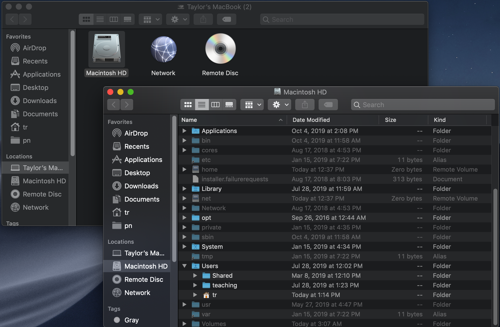

Goals & Objectives
------------------

#### What does this lesson cover?

This lesson provides a very brief introduction to the shell for new
users, or a quick refresher for those who have used it before. It also
provides additional resources

#### What does this lesson not cover?

Lot’s of things! Please don’t expect wizard-like proficiency from our
very short lesson.

#### Objectives

-   Describe key reasons for learning shell.
-   Navigate your file system using the command line.
-   Copy and move files using the command line
-   Understand the basics of remote computers
-   Download files from the internet using the command line
-   Know what `secure` commands `ssh` and `scp` are used for

How to access the shell
-----------------------

Please see the following setup page to get access to a shell on your
computer.

<a href="http://swcarpentry.github.io/shell-novice/setup.html" class="uri">http://swcarpentry.github.io/shell-novice/setup.html</a>

On a Mac or Linux machine you can access the shell through a program
called `Terminal`. Windows computers with &gt; Windows 10 can install
and use the Ubuntu Subsystem. For &lt; Windows 10, you will need to
download a separate program.

What is a shell and why should I care?
--------------------------------------

A shell is a computer program that presents a command line interface
which allows you to control your computer using commands entered with a
keyboard instead of controlling graphical user interfaces (GUIs) with a
mouse/keyboard combination.

There are many reasons to learn about the shell:

-   Many bioinformatics tools can only be used through a command line
    interface, or have extra capabilities in the command line version
    that are not available in the GUI. This is true, for example, of
    BLAST, which offers many advanced functions only accessible to users
    who know how to use a shell.
-   The shell makes your work less boring. In bioinformatics you often
    need to do the same set of tasks with a large number of files.
    Learning the shell will allow you to automate those repetitive tasks
    and leave you free to do more exciting things.
-   The shell makes your work less error-prone. When humans do the same
    thing a hundred different times (or even ten times), they’re likely
    to make a mistake. Your computer can do the same thing a thousand
    times with no mistakes.
-   The shell makes your work more reproducible. When you carry out your
    work in the command-line (rather than a GUI), your computer keeps a
    record of every step that you’ve carried out, which you can use to
    re-do your work when you need to. It also gives you a way to
    communicate unambiguously what you’ve done, so that others can check
    your work or apply your process to new data.
-   Many bioinformatic tasks require large amounts of computing power
    and can’t realistically be run on your own machine. These tasks are
    best performed using remote computers or cloud computing, which can
    only be accessed through a shell.

Navigating files and directories
--------------------------------

The part of the operating system responsible for managing files and
directories is called the file system. It organizes our data into files,
which hold information, and directories (also called ‘folders’), which
hold files or other directories.

Several commands are frequently used to create, inspect, rename, and
delete files and directories. To start exploring them, we’ll go to our
open shell window.

First let’s find out where we are by running a command called pwd (which
stands for ‘print working directory’). Directories are like places - at
any time while we are using the shell we are in exactly one place,
called our current working directory. Commands mostly read and write
files in the current working directory, i.e. ‘here’, so knowing where
you are before running a command is important. pwd shows you where you
are:

    pwd

You will see something like `/Users/tr`, which is tr’s home directory.

To understand what a ‘home directory’ is, let’s have a look at how the
file system as a whole is organized.

On my computer, the file system looks like this:



At the top is the root directory that holds everything else. We refer to
it using a slash character, /, on its own; this is the leading slash in
/Users/tr.

Inside that directory are several other directories: `bin` (which is
where some built-in programs are stored), `Users` (where users’ personal
directories are located), `tmp` (for temporary files that don’t need to
be stored long-term), and so on.

We know that our current working directory `/Users/tr` is stored inside
`/Users` because `/Users` is the first part of its name. Similarly, we
know that `/Users` is stored inside the root directory `/` because its
name begins with `/`.

Now let’s learn the command that will let us see the contents of our own
filesystem. We can see what’s in our home directory by running `ls`,
which stands for ‘listing’:

    ls

    Applications/ Documents/    Library/      Music/        Pictures/     farm/         github/       miniconda3/   papers/
    Desktop/      Downloads/    Movies/       Music.zip     Public/       ftp.whoi.edu/ igv/          ncbi/         projects/

This corresponds to the files that are in my home directory:


ls prints the names of the files and directories in the current
directory. We can get more information from `ls` by using the `-l` flag,
which tells `ls` to List the files in long format.

    ls -l

    total 43354112
    drwx------@  3 tr  staff    96B Mar  6  2019 Applications/
    drwx------+ 25 tr  staff   800B Oct  8 13:25 Desktop/
    drwx------+ 16 tr  staff   512B Aug 26 14:06 Documents/
    drwx------+ 45 tr  staff   1.4K Oct  7 15:27 Downloads/
    drwx------@ 68 tr  staff   2.1K Aug 11 13:00 Library/
    drwx------+  3 tr  staff    96B Feb 26  2019 Movies/
    drwx------+  4 tr  staff   128B Apr  1  2019 Music/
    -rw-rw-rw-   1 tr  staff    21G Feb 27  2019 Music.zip
    drwx------+  5 tr  staff   160B Oct  7 09:41 Pictures/
    drwxr-xr-x+  4 tr  staff   128B Feb 26  2019 Public/
    drwxr-xr-x  11 tr  staff   352B Oct  3 16:33 farm/
    drwxr-xr-x   3 tr  staff    96B Oct  7 17:04 ftp.whoi.edu/
    drwxr-xr-x  24 tr  staff   768B Oct  8 13:25 github/
    drwxr-xr-x   5 tr  staff   160B Apr  2  2019 igv/
    drwxr-xr-x  16 tr  staff   512B Oct  7 14:16 miniconda3/
    drwxr-xr-x   4 tr  staff   128B Oct  4 14:20 ncbi/
    drwxr-xr-x   4 tr  staff   128B Apr 29 08:56 papers/
    drwxr-xr-x  30 tr  staff   960B Sep 26 08:53 projects/

To get help with a command, you can either google it, or use the `man`
command:

    man ls

Press `q` to quit out of this view. Some commands also have a `--help`
or `-h` flag.

#### General syntax of a command

Consider the command below as a general example of a command, which we
will dissect into its component parts:

    ls -l /

ls is the command, with an option `-l` and an argument `/`. We’ve
already encountered flag which either start with a single dash (`-`) or
two dashes (`--`), and they change the behaviour of a command. Arguments
tell the command what to operate on (e.g. files and directories).
Sometimes options and arguments are referred to as parameters. A command
can be called with more than one option and more than one argument: but
a command doesn’t always require an argument or an option.

Each part is separated by spaces: if you omit the space between `ls` and
`-l` the shell will look for a command called ls-F, which doesn’t exist.
Also, capitalization can be important:
``` ls -`` is different from ```ls -L\`.

Putting all that together, our command above gives us a listing of files
and directories in the root directory `/`.

#### Moving around

We now know how to tell where we are (`pwd`) and see what files are in
our current directory (`ls`). What if we want to move directories? We
can use the command `cd`, which means “change directory”, to move
around.

Let’s move into our root directory:

    cd /

We can check and see if we really moved:

    pwd

To move back to our home directory, we can type:

    cd /Users/tr

or we can use the shortcut:

    cd ~

Working with files and directories
----------------------------------

Let’s create a directory in our home directory that will contain files
from this tutorial:

    mkdir shell_tutorial

We can change directories into this new folder:

    cd shell_tutorial

If we type `ls`, we’ll see we have an empty directory:

    ls

Let’s make a new, empty file in our directory:

    touch my_file.txt

If we type `ls` now, we’ll see we have a new file in our directory:

    ls

If we decide we don’t like our file name at some later point, we can use
the `mv` command, which stands for move, to move our file to a new name:

    mv my_file.txt file.txt

    ls

We can also create a copy of our file using the `cp` command:

    cp file.txt file2.txt

    ls

Introduction to remote computers and the cloud
----------------------------------------------

The cloud is basically lots of servers (think big computers) stacked
together in a giant, powerful infrastructure. You can borrow part of
this infrastructure for your computing needs.

There are two main approaches to accessing computing time and power: 1)
we can borrow computing time and resources from a commercial provider;
or 2) you may have access to a computing infrastructure through your
institution or somewhere else.


In either case, when using a remote computer, the computer is assigned
what is called an IP address. You can think of this like a mailing
address for a computer – it unambiguously demarcates where the computer
is, and allows people who know the address to find it.

Just like when you open your laptop (or go to the library and use a
public computer), you need to log on to a cloud computer to be able to
access it. The command `ssh` (secure shell) tells your computer to look
for the remote computer at it’s specific address, and if you are a user
with the right permission, login.

Some cloud computers allow the use of passwords for logging in while
others require what’s called a key file. Just like doors that lock have
both a lock and a key, key files come with both a public (the lock) and
private (the key) file. Like a doorknob, the lock is public facing and
anyone with the address can see it. However, only someone with the
specific key for the specific lock can unlock the door and get into the
computer. For more on keys files and how to create them, see this
[lesson](http://swcarpentry.github.io/shell-extras/02-ssh/).

Accessing remote files
----------------------

#### Downloading files from the internet

There are two programs that will download data from a remote server to
your local (or remote) machine: `wget` and `curl`. They were designed to
do slightly different tasks by default, so you’ll need to give the
programs somewhat different options to get the same behaviour, but they
are mostly interchangeable.

-   `wget` is short for “world wide web get”, and it’s basic function is
    to *download* web pages or data at a web address.
-   `cURL` is a pun, it is supposed to be read as “see URL”, so its
    basic function is to *display* webpages or data at a web address.

Which one you need to use mostly depends on your operating system, as
most computers will only have one or the other installed by default.

Let’s say you want to download some data from Ensembl. We’re going to
download a very small tab-delimited file that just tells us what data is
available on the Ensembl bacteria server. Before we can start our
download, we need to know whether we’re using `curl` or `wget`.

To see which program you have, type:

    which curl
    which wget

`which` is a BASH program that looks through everything you have
installed, and tells you what folder it is installed to. If it can’t
find the program you asked for, it returns nothing, i.e. gives you no
results.

MacOS does not come with `wget` pre-installed.

Once you know whether you have `curl` or `wget`, use one of the
following commands to download the file:

    cd shell_tutorial
    wget ftp://ftp.ensemblgenomes.org/pub/release-37/bacteria/species_EnsemblBacteria.txt

or

    cd shell_tutorial
    curl -O ftp://ftp.ensemblgenomes.org/pub/release-37/bacteria/species_EnsemblBacteria.txt

Since we wanted to *download* the file rather than just view it, we used
`wget` without any modifiers. With `curl` however, we had to use the
`-O` flag, which tells `curl` to download the page **and** specifies
that it should redirect the output to a file named
`species_EnsemblBacteria.txt`.

#### Looking at files

Using `ls`, we can see that our download was successful:

    ls

However, now we want to inspect the contents of the file. We will learn
four commands to do this.

First, let’s use `cat` to look at the contents

    cat species_EnsemblBacteria.txt

It’s all streaming by so fast! I can’t read it! I know there’s stuff
there but how do I make it stop!

Type `ctrl` + `c` to end any command that is running in the shell.

We can use the `head` command to look at only the first 10 lines:

    head species_EnsemblBacteria.txt

Similarly, we can use `tail` to look at only the last 10 lines:

    tail species_EnsemblBacteria.txt

Lastly, we can use `less` to get a scrollable view:

    less species_EnsemblBacteria.txt

Use `q` to exit out of this viewer.

#### Transferring files from a local computer to a remote machine

We use a another “secure” command, `scp`, to copy files from a local
machine to a remote machine, or vice versa. This command is run from
your *local* computer (i.e. from your laptop).

The scp command looks like this:

    scp <file I want to move> <where I want to move it>

If we assume we want to transfer files from a remote computer to our
local computer, this would look something like this:

    scp username@ipaddress:~/outputs/my_file.txt ~/Desktop/my_file.txt

The first part of the command is the address for your remote computer.
If you were using this command, you would replace `username` and
`ipaddress` with your username and your cloud computers ip address.

The second part starts with a `:` and then gives the absolute path of
the files you want to transfer from your remote computer.

The third part of the command gives the absolute path of the location
you want to put the files.

`scp` also requires a password or a keyfile to run.

For more on how to use `scp`, please see this
[lesson](http://swcarpentry.github.io/shell-extras/02-ssh/).

References and Links
--------------------

This lesson was modified from the following existing lessons:

-   <a href="https://datacarpentry.org/shell-genomics/01-introduction/index.html" class="uri">https://datacarpentry.org/shell-genomics/01-introduction/index.html</a>
-   <a href="http://swcarpentry.github.io/shell-novice/01-intro/index.html" class="uri">http://swcarpentry.github.io/shell-novice/01-intro/index.html</a>
-   <a href="http://swcarpentry.github.io/shell-novice/02-filedir/index.html" class="uri">http://swcarpentry.github.io/shell-novice/02-filedir/index.html</a>
-   <a href="http://swcarpentry.github.io/shell-novice/03-create/index.html" class="uri">http://swcarpentry.github.io/shell-novice/03-create/index.html</a>
-   <a href="https://angus.readthedocs.io/en/2019/cloud_computing_intro.html" class="uri">https://angus.readthedocs.io/en/2019/cloud_computing_intro.html</a>
-   <a href="http://swcarpentry.github.io/shell-extras/02-ssh/" class="uri">http://swcarpentry.github.io/shell-extras/02-ssh/</a>
-   <a href="https://datacarpentry.org/shell-genomics/05-writing-scripts/" class="uri">https://datacarpentry.org/shell-genomics/05-writing-scripts/</a>

For more material and practice:

-   <a href="https://angus.readthedocs.io/en/2019/shell_intro/index.html" class="uri">https://angus.readthedocs.io/en/2019/shell_intro/index.html</a>
-   <a href="http://swcarpentry.github.io/shell-extras/" class="uri">http://swcarpentry.github.io/shell-extras/</a>
-   <a href="https://datacarpentry.org/shell-genomics/" class="uri">https://datacarpentry.org/shell-genomics/</a>
-   <a href="https://angus.readthedocs.io/en/2019/jetstream/boot.html#ssh-secure-login" class="uri">https://angus.readthedocs.io/en/2019/jetstream/boot.html#ssh-secure-login</a>
